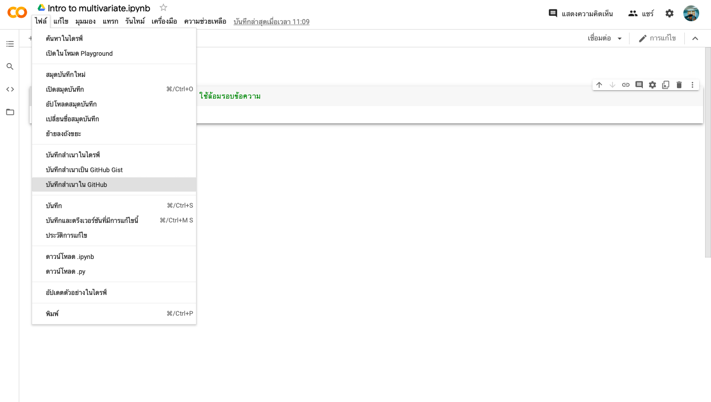

# multivariate

## ฐิติวัฒน์ จันทรเสนา ID 623021047-5

.md => Markdown

[ ] square brackets 

( ) parentheses

อธิบายการใช้งาน Github และ Google Colab ว่าหน้าที่ของแต่ละอันคืออะไร และอธิบายวิธีเซพไฟล์จาก Google Colab ลงใน Github

## หน้าที่ของ Github และ Google Colab

| ชื่อ | การใช้งาน |
| ------------- | ------------- |
| Github |เว็ปไซต์ที่ทำให้เราสามารถใช้ Git ร่วมกับคนอื่นได้ หรือพูดง่ายๆก็คือ Git ที่อยู่บนเว็บไซต์ |
| Google Colab | ช่วยให้คุณเขียนและเรียกใช้ Python ในเบราว์เซอร์โดย ไม่ต้องกำหนดค่าใด เข้าถึง GPU ได้โดยไม่มีค่าใช้จ่าย และ แชร์ได้ง่ายๆ |

## วิธีเซพไฟล์จาก Google Colab ลงใน Github

1.เปิด Google Colab

2.คลิกที่ ไฟล์

3.แล้วเลือก บันทึกสำเนาใน Github

